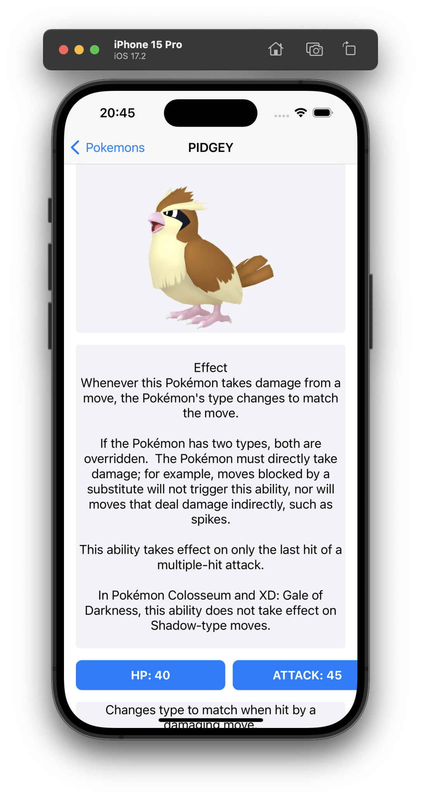
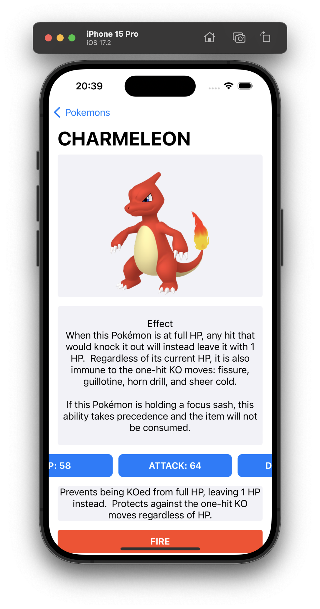

# Pokemon-App

This app was created as two pages. on the first page "pokeapi.co " pokemon withdrawn from the address are listed. On the second page, the details of these pokemon, various features are shown.

### Keywords

<ul>
    <li>MVVM</li>
    <li>Object Oriented Programming</li>
    <li>Protocol Oriented Programming</li>
    <li>Pagination</li>
    <li>GenericNetworkLayer</li>
    <li>URLSession</li>
    <li>UIKIT</li>
    <li>TableView</li>
    <li>CollectionView</li>
    <li>Codable</li>
    <li>Spm</li>
    <li>KingFisher</li>
</ul>

    | Pagination | List Screen | Detail Screen | Detail Screen | 

| ------------- | ------------- | --------------- | --------------- |
|  |  |   |   |

</video>

